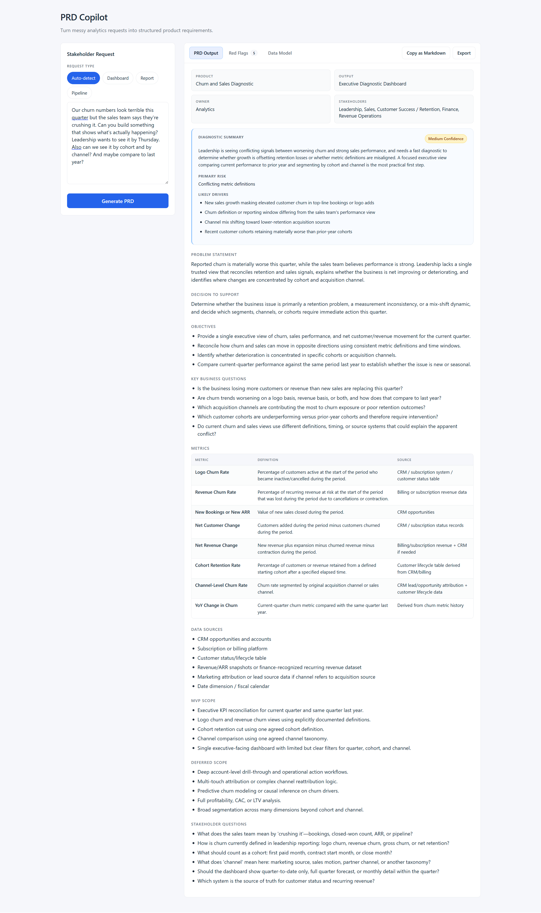
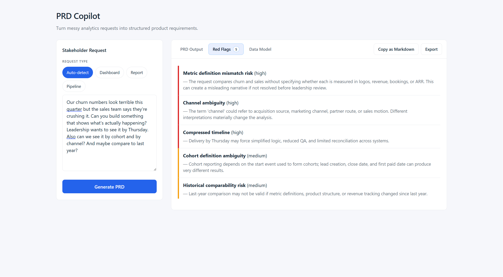
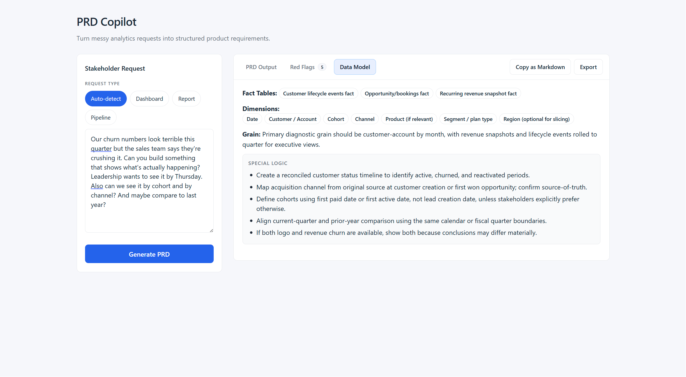

# PRD Copilot

Turn messy analytics stakeholder requests into structured product requirement documents — instantly.

PRD Copilot takes a free-text request and generates a full PRD including problem statement, objectives, metrics, data model suggestions, MVP scope, and red flags. Powered by OpenAI's structured output API.

## Motivation

Analytics stakeholders often come to data teams with vague, context-light requests. Before any work starts, someone has to translate "we need to understand churn" into a scoped, unambiguous spec. I built PRD Copilot to automate that translation — turning a raw ask into a structured document that surfaces assumptions, flags risks, and proposes a data model, before a single line of SQL is written.

| PRD Output | Red Flags | Data Model |
|---|---|---|
|  |  |  |

## Features

- Paste any stakeholder request and get a structured PRD in seconds
- Supports three output types: Executive Diagnostic Dashboard, Diagnostic Analysis Report, or Pipeline
- Auto-detects the best output type when unspecified
- Surfaces red flags, risk levels, and likely drivers
- Suggests fact tables, dimensions, grain, and data sources
- Separates MVP scope from deferred scope

## Tech stack

| Layer | Technology |
|-------|-----------|
| Frontend | React 19, TypeScript, Vite |
| Backend | Node.js, Express 5 |
| AI | OpenAI `gpt-5.4` with structured JSON schema output |

## Prerequisites

- Node.js 18+
- An [OpenAI API key](https://platform.openai.com/api-keys)

## Setup

**1. Clone the repo**

```bash
git clone https://github.com/your-username/prd-copilot.git
cd prd-copilot
```

**2. Install dependencies**

```bash
npm install
```

**3. Configure environment variables**

```bash
cp .env.example .env
```

Open `.env` and add your OpenAI API key:

```
OPENAI_API_KEY=sk-...
PORT=3001
```

## Running locally

You need two processes running at the same time: the Express backend and the Vite dev server.

**Terminal 1 — start the backend**

```bash
npm run server
```

The API will be available at `http://localhost:3001`.

**Terminal 2 — start the frontend**

```bash
npm run dev
```

Open `http://localhost:5173` in your browser.

## How to use

1. Paste a stakeholder request into the text area (e.g. *"We need to understand why churn spiked last quarter"*)
2. Select an output type or leave it on **Auto-detect**
3. Click **Generate PRD**
4. Review the structured output across the Overview, Metrics, Model Design, and Red Flags panels

## Project structure

```
prd-copilot/
├── server/
│   ├── index.js        # Express API server
│   ├── prompt.js       # System prompt for the AI
│   └── schema.js       # JSON schema for structured output
├── src/
│   ├── components/     # React UI components
│   ├── types/          # TypeScript types
│   ├── utils/          # Formatting helpers
│   └── App.tsx         # Root component
├── .env.example        # Environment variable template
└── vite.config.ts
```

## Environment variables

| Variable | Required | Description |
|----------|----------|-------------|
| `OPENAI_API_KEY` | Yes | Your OpenAI API key |
| `PORT` | No | Backend port (default: `3001`) |

## License

MIT
